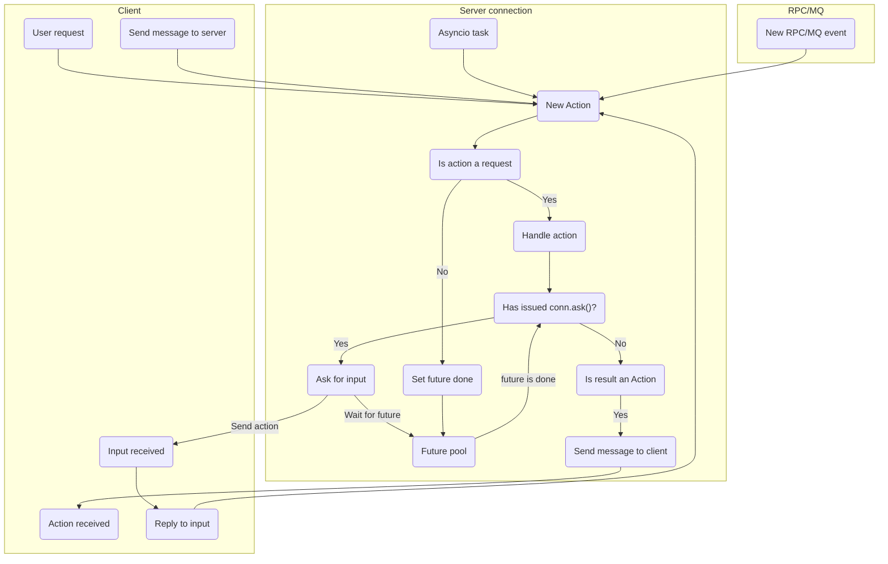

# How does it work

## Server

### Server: Start

1. Listen to `host:port`
2. Accept connection
3. [Handle connection](#server-handle-connection) in async thread
4. `GOTO 2`

### Server: Handle connection

1. Receive `protocol_version: uInt1`
2. If protocol is invalid
   1. Send `00`
   2. Close connection
   3. `STOP`
3. Send `01`
4. Receive `INIT`
5. Validate and store client time, api version, etc.
6. Send `INIT`
7. If `handshake is not None`, do:
   1. Receive handshake
   2. If handshake broken
      1. Send `00`
      2. close connection
      3. `STOP`
   3. Send `01`
8. [Listen for requests](#server-listen-for-requests) in async thread

### Server: Listen for requests

==- Connection life flow

===

1. Try:
   1. Receive `action_id: uInt1`
   2. Find matching `Action` type
   3. Create `Action[action_id]` instance
   4. Receive `Action` HEAD
   5. If HEAD invalid
      2. Read payload `> /dev/null`
      1. Raise `ProtocolError`
   6. If not delayable
      1. Receive payload
      2. Decompress, decode, etc. payload
   7. Find `Handler` by `Action[action](HEAD).handler_id`
   8. Create `Handle(Action)` instance
   9. Wrap `handler` with `Middleware`
   10. Call `middleware[middleware[handler]]`
   1. Call `handler.prepare`
      1. If HEAD is invalid
         1. If payload delayed, read payload `> /dev/null`
         2. Raise `ValueError`
   2. if payload recv delayed
      1. Receive payload
      2. Decompress, decode, etc. payload
   3. Call `handler.handle()`
   4. If result is `Action`
      1. Call `Action.send(handler.action.conn)`
2. `GOTO 1`

## Client

1. Connect to Server
2. Send `protocol_version: uInt1`
3. Recv `status: uInt1`
4. If not status:
   1. ?Reconnect?
   2. `STOP`
5. Send `INIT`
6. Recv `INIT`
7. If `handshake is not None`
8. SEND `Handshake`
9. RECV `status: uInt1`
10. If not status
1. `STOP`
11. [Listen for actions](#client-listen-for-actions) in async thread

### Client: Listen for actions

1. Try:
   1. Recv `action_id: uInt1`
   2. Find matching `Action` type
   3. Create `Action[action_id]` instance
   4. Receive `Action` HEAD
   5. If HEAD invalid
      1. Read payload `> /dev/null`
      2. Raise `ProtocolError`
   6. If not delayable
      1. Receive payload
      2. Decompress, decode, etc. payload
   7. If `message_id` is in `recv` pool:
      1. Pass `action` to `conn.recv()` Future
      2. `GOTO 1`
   8. If `message_id` is in `0x8000` to `0xFFFF` range:
      1. Find `Listener[action.head.handler_id]`
      2. Pass `action` to `Listener`
      3. `GOTO 1`
2. `GOTO 1`